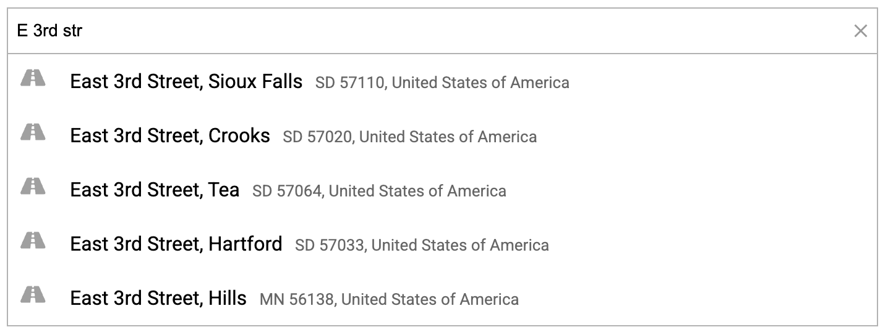

# Angular Geocoder Autocomplete

The Angular Geocoder Autocomplete component integrates the [@geoapify/geocoder-autocomplete](https://www.npmjs.com/package/@geoapify/geocoder-autocomplete) library into Angular, enabling advanced address search powered by the [Geoapify Geocoding Autocomplete](https://www.geoapify.com/address-autocomplete/) service.

## Overview

Angular Geocoder Autocomplete is a lightweight, easy-to-use Angular component that brings intelligent location and address suggestions into your applications.  
It’s designed to offer a fast, accessible, and customizable autocomplete experience using high-quality global geocoding data.

## Features

* **Simple Angular integration** – Import `GeoapifyGeocoderAutocompleteModule` in an NgModule. Standalone applications can import the module in a component and configure it with `importProvidersFrom`.

* **Fast and responsive search** – Built-in request debouncing and cancellation ensure smooth typing without unnecessary API calls, even during rapid input changes.

* **Localized results** – Supports language and country filters, enabling region-specific and multilingual autocomplete suggestions for improved user experience.

* **Flexible configuration** – Easily adjust search behavior using parameters such as `bias`, `filter`, and `limit`. You can also restrict results to a bounding box or preferred region.

* **Customizable design** – Provides processing hooks and bundled CSS themes that can be extended for your application.

* **Keyboard navigation** – Supports keyboard-based suggestion navigation and selection.

* **Rich structured output** – Emits detailed selection events containing coordinates, formatted addresses, and Geoapify metadata that can be directly used in your app logic.

* **Angular compatibility** – Version 3.1.x supports Angular 19 through Angular 22 and uses `@geoapify/geocoder-autocomplete` 3.1.x.

## Learn More

- [Quick Start](quick-start.md)
- [API Reference](api-reference.md)
- [Examples](examples.md)
- [Standalone Usage](standalone-usage.md)
- [Geoapify Geocoding API documentation](https://apidocs.geoapify.com/docs/geocoding/)
- [GitHub repository](https://github.com/geoapify/angular-geocoder-autocomplete)
- [Geoapify Developer Portal](https://www.geoapify.com/)
